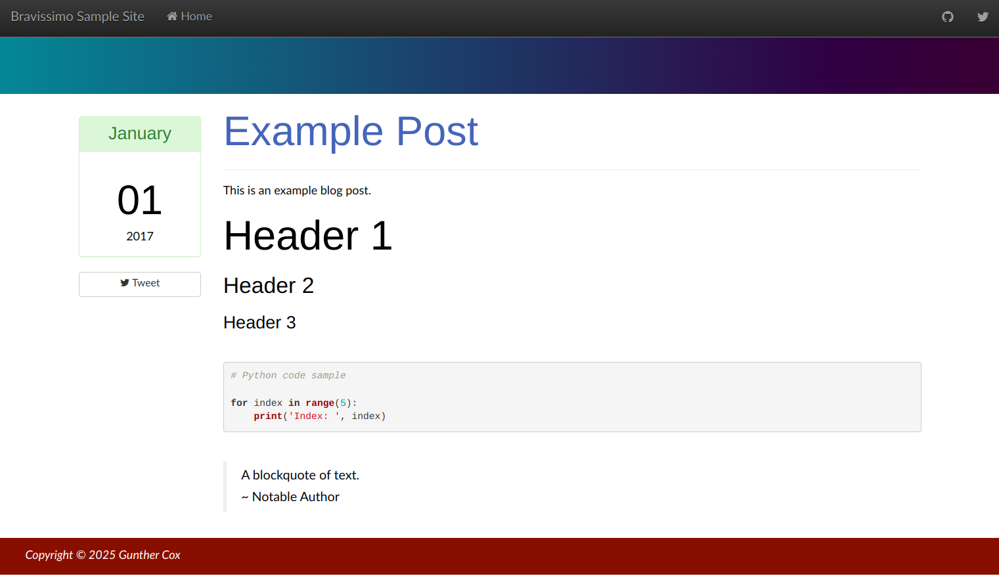

# bravissimo

Theme (gem based) for [Jekyll](https://jekyllrb.com/) sites.



## Usage

```bash
gem install bravissimo
```

In your Jekyll `_config.yml` file add:

```yaml
theme: bravissimo
```

## Development

```bash
install: script/bootstrap
script: script/cibuild
```

## Publishing New Gem Versions

Example:

```bash
gem build bravissimo.gemspec
gem push bravissimo-0.1.3.gem
```
